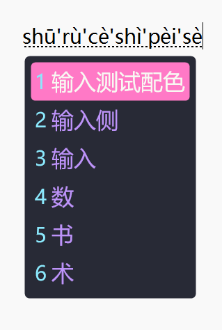
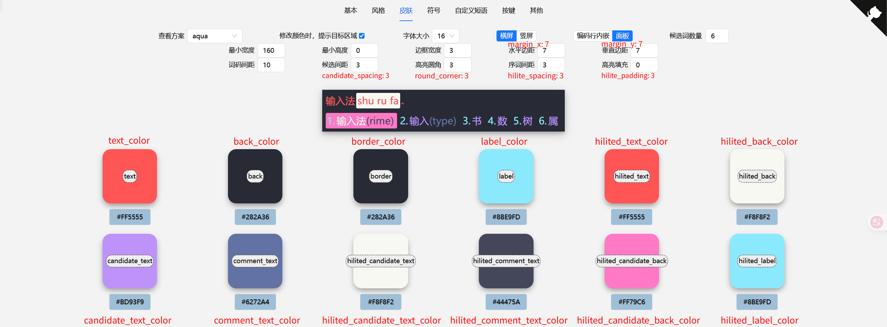

# AmenDracula for Rime

> 具体效果灵感来自 [Dracula Theme for Rime](https://draculatheme.com/rime)

[自用 Rime 配置](https://github.com/AmenLi/AmenRimeConfigs)

## 配色预览

**上方为 color_scheme_AmenDracula.png**，路径：C:\Users\用户名\AppData\Roaming\Rime\preview

## 调色板

使用 Dracula [调色板](https://github.com/dracula/dracula-theme#color-palette)的部分颜色

| 名字                                              | RGB 的 Hex  | BGR 的 Hex  |  |
| ------------------------------------------------- | ----------- | ----------- | ------------------------------------------------------------------------------- |
| back_color / border_color                         | `#282A36` | `#362A28` |    |
| hilited_comment_text_color                        | `#44475A` | `#5A4744` |      |
| hilited_back_color / hilited_candidate_text_color | `#F8F8F2` | `#F2F8F8` |    |
| comment_text_color                                | `#6272A4` | `A47262`  |          |
| label_color / hilited_label_color                 | `#8BE9FD` | `#FDE98B` |                |
| hilited_candidate_back_color                      | `#FF79C6` | `C679FF`  |                |
| candidate_text_color                              | `#BD93F9` | `#F993BD` |            |
| text_color / hilited_text_color                   | `#FF5555` | `#5555FF` |                  |

润米配置截图如下：

## 自定义

主题示例可参考雾凇拼音的 [`weasel.yaml`](https://github.com/iDvel/rime-ice/blob/main/weasel.yaml)

此配色按个人喜好做了修改，主要是修改候选框的样式。
减少空白以在 16 英寸的笔记本屏幕更好的显示，微调颜色更好的分辨候选词。

在润笔调整颜色时输入 RGB 的 Hex，润笔生成的是十进制颜色代码，在 Rime 里最好使用带 0x 的 BGR 的 Hex。

你可以使用[润笔](https://pdog18.github.io/rime-soak/#/theme)再做修改，或者使用[西米](https://fxliang.github.io/RimeSeeMe/)。

## 安装

复制主题的配置到自己方案的 `weasel.custom.yaml` 里。

字体效果依据你的配置显示。

注意 Rime 的 YAML 的语法缩进是两个空格，不能是 Tab 格式。

## License

[MIT License](./LICENSE)

