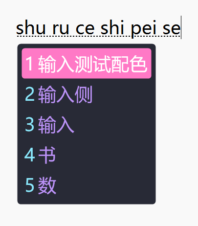
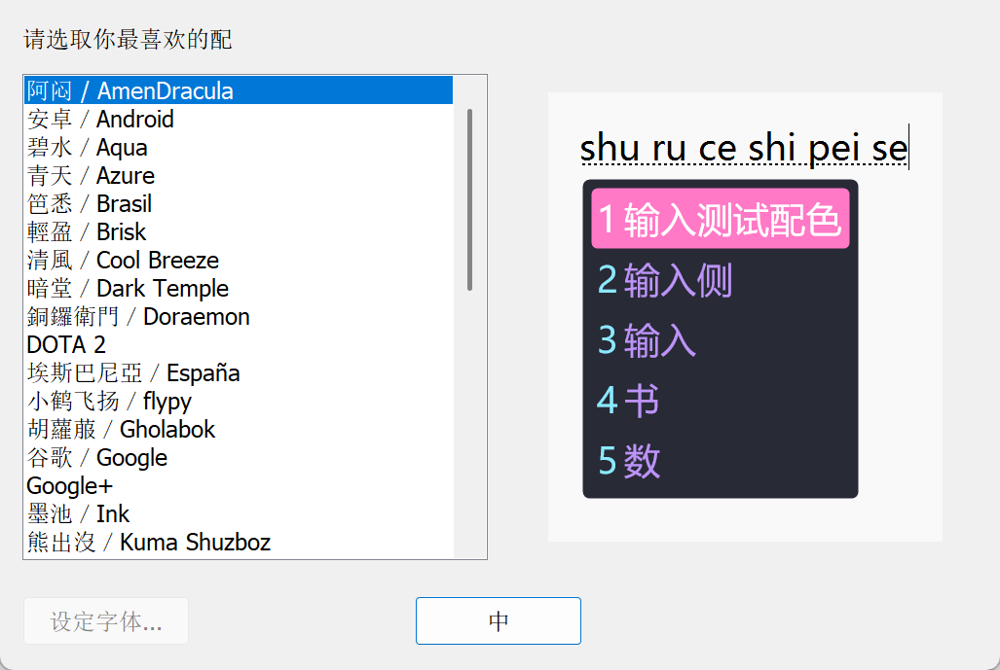

# AmenDracula for Rime

> 使用 Dracula 的[调色盘](https://github.com/dracula/dracula-theme#color-palette)，具体效果灵感来自 [Dracula Theme for Rime](https://draculatheme.com/rime)

## 配色预览

## 自定义

请注意，此主题并未完全配置一个完整的 Rime 主题，只使用的部分参数。
`inline_preedit: false` 时，行内显示预编辑区的配色并未设置，会不好看。

主题示例可参考雾凇拼音的 [`weasel.yaml`](https://github.com/iDvel/rime-ice/blob/main/weasel.yaml)。

此配色按个人喜好做了修改，主要是修改候选框的样式，减少空白在 16 英寸的笔记本屏幕更好的显示。微调颜色更好的分辨候选词。

配色的数值是由[润笔](https://pdog18.github.io/rime-soak/#/theme)生成的。

你可以使用[润笔](https://pdog18.github.io/rime-soak/#/theme)再做修改，或者使用[西米](https://fxliang.github.io/RimeSeeMe/)。

## 安装

复制主题的配置到自己方案的 `weasel.custom.yaml` 里。

字体效果依据你的配置显示。

注意Rime 的 YAML 的语法缩进是两个空格，不能是 Tab 键。

## License

[MIT License](./LICENSE)
